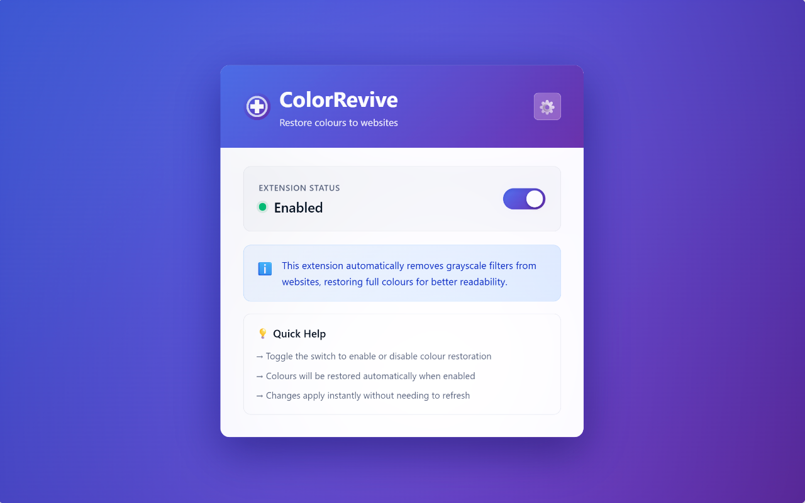
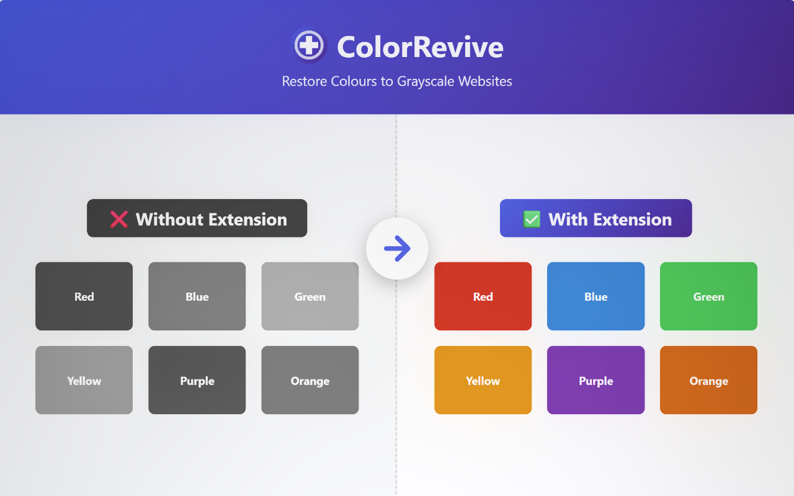
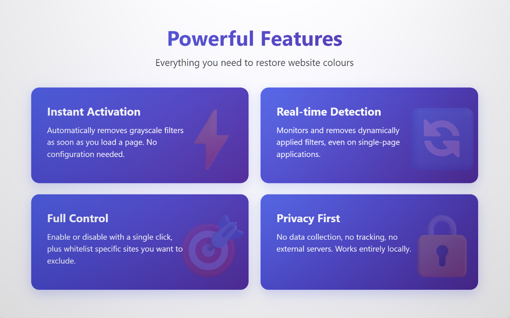

# ColorRevive ➕

A browser extension for Chrome and Firefox that automatically removes grayscale filters from websites, restoring vibrant colours for better readability.

**[English](README.md) | [ภาษาไทย](README.th.md)**

## 🌟 Overview

  

ColorRevive detects and removes CSS grayscale filters applied to websites, instantly restoring full colour. Whether websites use grayscale for design choices, accessibility features, or special occasions, ColorRevive gives you control to view content in full colour when you need better readability.

  

The extension works silently in the background, automatically detecting and removing grayscale filters while you browse. With a simple toggle, you can enable or disable the colour restoration at any time.

## ✨ Features

- 🎯 **Automatic Colour Restoration** - Instantly removes grayscale filters when you visit a website
- 📝 **Whitelist Control** - Choose which sites to keep in grayscale
- 🔒 **Privacy-First** - No data collection, everything stays on your computer
- ⚙️ **No Setup Required** - Just install and it works
- 🦊 **Works Everywhere** - Compatible with any Chrome-based and Firefox-based browsers

  

## 🎯 Use Cases

ColorRevive is designed to help in various scenarios:

### 1. **Mourning Period Websites**
Many websites, particularly in Thailand and other Asian countries, apply grayscale filters during mourning periods as a mark of respect. While culturally significant, this can make content difficult to read, especially on websites with media and images.

**Example:** Thai government websites, news portals, and banks often apply `filter: grayscale(100%)` during national mourning periods.

### 2. **Accessibility Improvements**
Some users find grayscale websites harder to read due to:
- Reduced contrast making text less legible
- Difficulty distinguishing UI elements
- Eye strain from monochrome displays
- Confusion in colour-coded information

## 🚀 Installation

### Google Chrome / Chromium-based

#### From Chrome Web Store (Recommended)
1. Visit the [Chrome Web Store](#) (coming soon)
2. Click "Add to Chrome"
3. Enjoy!

### Mozilla Firefox / Gecko-based

#### From Firefox Add-ons (Recommended)
1. Visit [Firefox Add-ons](#) (coming soon)
2. Click "Add to Firefox"
3. Enjoy!

## 🤝 Contributing

Found a bug or have a suggestion? Feel free to report issues on [GitHub Issues](https://github.com/thongtech/colorrevive/issues)

All contributions are welcome!
