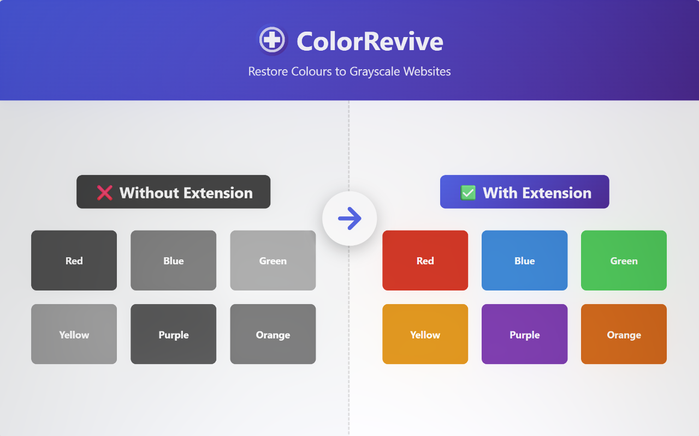
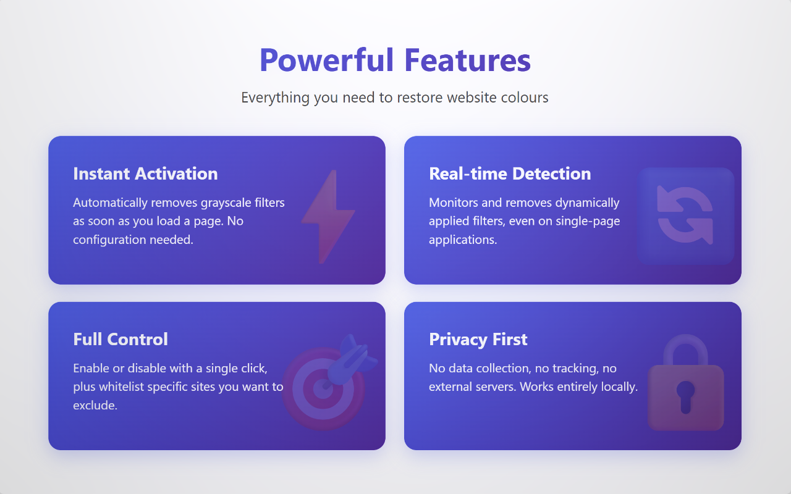

# ColorRevive ➕

ส่วนขยายเบราว์เซอร์สำหรับ Chrome และ Firefox ที่ลบฟิลเตอร์ขาวดำออกจากเว็บไซต์โดยอัตโนมัติ เพื่อคืนสีสันที่สดใสและเพิ่มความสะดวกในการอ่าน

**[English](README.md) | [ภาษาไทย](README.th.md)**

## 🌟 ภาพรวม

  

ColorRevive ตรวจจับและลบฟิลเตอร์ CSS สีขาวดำที่ใช้กับเว็บไซต์ต่างๆ แล้วคืนสีสันกลับมาทันที ไม่ว่าเว็บไซต์จะใช้โทนขาวดำเพื่อการออกแบบ คุณสมบัติการเข้าถึง หรือในโอกาสพิเศษ ช่วยให้คุณสามารถควบคุมการดูเนื้อหาในแบบเต็มสีได้เมื่อต้องการความสะดวกในการอ่านมากขึ้น

  

ส่วนขยายทำงานอย่างเงียบๆ ในเบื้องหลัง ตรวจจับและลบฟิลเตอร์ขาวดำโดยอัตโนมัติในขณะที่คุณท่องเว็บ โดยคุณสามารถเปิดหรือปิดการคืนสีได้ตลอดเวลาด้วยการสลับสวิตช์

## ✨ คุณสมบัติ

- 🎯 **คืนสีสันอัตโนมัติ** - ลบฟิลเตอร์ขาวดำทันทีเมื่อเข้าชมเว็บไซต์
- 📝 **จัดการ Whitelist** - เลือกคงฟิลเตอร์สีขาวดำไว้บนบางเว็บได้
- 🔒 **เน้นความเป็นส่วนตัว** - ไม่มีการเก็บข้อมูล ทุกอย่างอยู่ในเครื่องของคุณ
- ⚙️ **ไม่ต้องตั้งค่า** - ติดตั้งแล้วใช้งานได้ทันที
- 🦊 **ใช้ได้หลายเบราว์เซอร์** - รองรับเบราว์เซอร์ที่ใช้พื้นฐาน Chrome และ Firefox ทุกประเภท

  

## 🎯 เคสการใช้งาน

ColorRevive ออกแบบมาเพื่อช่วยในสถานการณ์ต่างๆ ดังนี้:

### 1. **เว็บไซต์ในช่วงไว้ทุกข์**
เว็บไซต์หลายแห่ง โดยเฉพาะในประเทศไทยและประเทศในเอเชียอื่นๆ มักจะใช้ฟิลเตอร์ขาวดำในช่วงไว้ทุกข์เพื่อแสดงความเคารพ แม้ว่าจะมีความสำคัญทางวัฒนธรรม แต่อาจทำให้เนื้อหาอ่านยากขึ้น โดยเฉพาะเว็บไซต์ที่มีสื่อและรูปภาพ

**ตัวอย่าง:** เว็บไซต์ภาครัฐไทย พอร์ทัลข่าว และธนาคารมักใช้ `filter: grayscale(100%)` ในช่วงไว้ทุกข์แห่งชาติ

### 2. **ปรับปรุงการเข้าถึง**
ผู้ใช้บางคนอาจพบว่าเว็บไซต์ขาวดำอ่านยากขึ้น เนื่องจาก:
- ความคมชัดลดลง ทำให้อ่านข้อความได้ยากขึ้น
- ยากต่อการแยกแยะองค์ประกอบ UI ต่างๆ
- เกิดความเมื่อยล้าของสายตาจากการแสดงผลแบบขาวดำ
- สับสนกับข้อมูลที่ใช้สีในการแยกประเภท

## 🚀 การติดตั้ง

### Google Chrome / Chromium-based

#### จาก Chrome Web Store (แนะนำ)
1. เข้าชม [Chrome Web Store](#) (เร็วๆ นี้)
2. คลิก "เพิ่มใน Chrome"
3. เสร็จสิ้น!

#### จาก GitHub Release
1. ดาวน์โหลด `colorrevive-chrome-<version>.zip` จาก [Releases](https://github.com/thongtech/colorrevive/releases/latest)
2. แตกไฟล์ ZIP
3. เปิด `chrome://extensions/` ในเบราว์เซอร์
4. เปิดใช้งาน "Developer mode" (สลับสวิตช์ที่มุมขวาบน)
5. คลิก "Load unpacked"
6. เลือกโฟลเดอร์ที่แตกไฟล์ไว้
7. ไอคอนส่วนขยายจะปรากฏในแถบเครื่องมือ

### Mozilla Firefox / Gecko-based

#### จาก Firefox Add-ons (แนะนำ)
1. เข้าชม [Firefox Add-ons](https://addons.mozilla.org/en-GB/firefox/addon/colorrevive/)
2. คลิก "เพิ่มใน Firefox"
3. เสร็จสิ้น!

#### จาก GitHub Release
1. ดาวน์โหลด `colorrevive-firefox-<version>.zip` จาก [Releases](https://github.com/thongtech/colorrevive/releases/latest)
2. แตกไฟล์ ZIP
3. เปิด `about:debugging#/runtime/this-firefox` ในเบราว์เซอร์
4. คลิก "Load Temporary Add-on"
5. ไปยังโฟลเดอร์ที่แตกไฟล์ไว้ แล้วเลือก `manifest.json`
6. ส่วนขยายจะถูกโหลดชั่วคราว (จะถูกลบเมื่อปิดเบราว์เซอร์)

## 🤝 การมีส่วนร่วม

หากพบข้อผิดพลาดหรือมีข้อเสนอแนะ สามารถรายงานปัญหาได้ที่ [GitHub Issues](https://github.com/thongtech/colorrevive/issues)

เรายินดีรับทุกการมีส่วนร่วมครับ!
